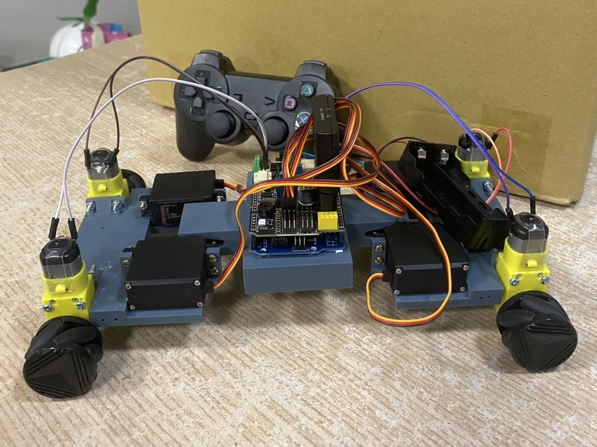

這是一台能夠攀爬由 A4 紙包裝組成樓梯的機器人，能夠自地面爬升至五階樓梯。
This is a robot designed to climb stairs made of A4 paper packaging. It can ascend from the ground up to the fifth step.

## 結構與機構設計  Structure and Mechanical Design
機器人整體結構分為三段，分別是前段與後段的馬達模組，以及中間連接兩端的橋接結構（bridge）。
The robot consists of three main sections: the front and rear motor modules, and a central bridge structure that connects both ends.

## 馬達與移動系統  Motors and Mobility
本機器人採用伺服馬達作為支撐與關節動力，負責帶動前後段向上或向下擺動，實現爬樓梯的動作。
移動部分則搭載直流馬達（TT 馬達）搭配減速機構，並結合麥克納姆輪來實現多方向移動控制。
Servo motors are used to support the structure and serve as joints, enabling the front and rear segments to pivot upward and downward for stair climbing.
For movement, the robot is equipped with DC motors (TT motors) coupled with reduction gears and Mecanum wheels, allowing omnidirectional motion control.

## 操控系統  Control System
操控部分使用 emakefun 公司推出的 MotorDriverBoard V5.2，搭配 Arduino Uno 作為主控板，並結合主板上的 PS2X 控制器進行遙控操作。
（資料來源：[emakefun/MotorDriverBoard GitHub](https://github.com/emakefun/MotorDriverBoard)）
The control system is based on emakefun's MotorDriverBoard V5.2, combined with an Arduino Uno as the main controller. A PS2X controller, connected to the board, is used for remote control.
(Source: [emakefun/MotorDriverBoard GitHub](https://github.com/emakefun/MotorDriverBoard))